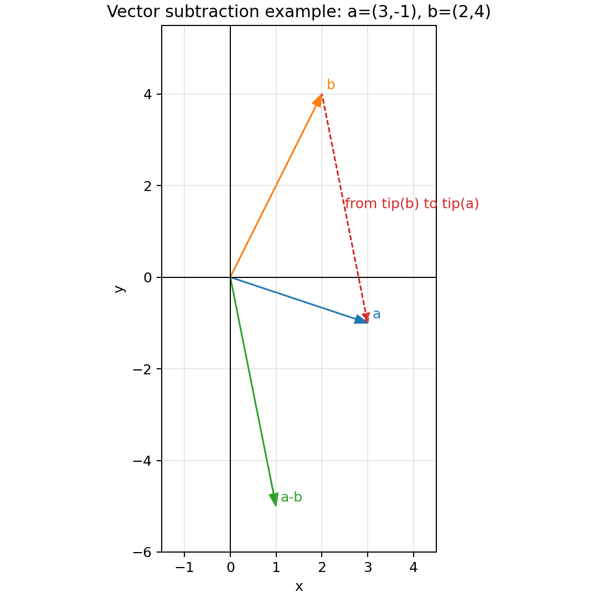

# Book 1 — Lecture 1, Interlude 1, Exercise 2

Written notes for this exercise. Helper code lives in
[`exercise_02.py`](../../../../src/theoretical_minimum/book1/lecture_01/interlude_01/exercise_02.py).

## Prompt

Work out the rule for vector subtraction.

## Rule

Vector subtraction is defined componentwise:

$$
\mathbf{a}-\mathbf{b}=(a_1-b_1,\dots,a_n-b_n).
$$

Equivalent and often more useful form:

$$
\mathbf{a}-\mathbf{b}=\mathbf{a}+(-\mathbf{b}),
$$

where $-\mathbf{b}$ is the additive inverse of $\mathbf{b}$.

## Geometric interpretation

- If vectors share the same tail, $\mathbf{a}-\mathbf{b}$ is the vector from the
  tip of $\mathbf{b}$ to the tip of $\mathbf{a}$.
- In 2D/3D drawings, this is the same as adding $\mathbf{a}$ to the reversed
  arrow $-\mathbf{b}$.

## Quick check in 2D

$$
(3,-1)-(2,4)=(3-2,-1-4)=(1,-5).
$$

## Example drawing (GitHub preview)

The figure below visualizes the same 2D example with
$\mathbf{a}=(3,-1)$, $\mathbf{b}=(2,4)$, and $\mathbf{a}-\mathbf{b}=(1,-5)$.
The dashed red arrow shows the "tip of $\mathbf{b}$ to tip of $\mathbf{a}$"
interpretation.

